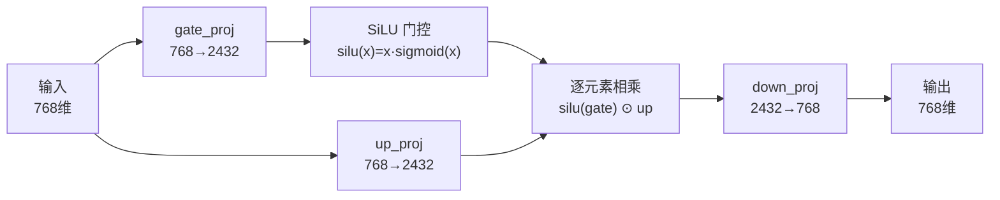

# Transformer 基础知识完全指南

> 目标：看完能画出 Transformer 架构图，讲清楚数据怎么流动。

---

## 一、Transformer 解决什么问题

在 Transformer 出现之前（2017 年以前），处理文本的主流方案是 RNN（循环神经网络）：

```
RNN 的工作方式（必须按顺序读）：
  "我" → 读完 → 输出状态1
  "爱" → 基于状态1 + "爱" → 输出状态2
  "你" → 基于状态2 + "你" → 输出状态3

致命缺陷：
  ✗ 必须顺序执行，无法并行 → 训练太慢
  ✗ 读到第 100 个字时，第 1 个字的信息几乎消失了
```

Transformer 的革新：**让每个字同时"看到"所有其他字。**

```
Transformer 的工作方式：
          我  爱  你
    我    ✓   ✓   ✓      ← "我"可以同时看自己、"爱"、"你"
    爱    ✓   ✓   ✓      ← "爱"可以同时看所有字
    你    ✓   ✓   ✓      ← "你"也可以同时看所有字

优势：
  ✓ 可以并行计算（所有字一起算）→ 训练快 N 倍
  ✓ 任意距离的两个字都能直接交互 → 不会"忘记"
```

---

## 二、整体架构

原论文的架构图（把 Encoder 去掉，MiniMind 只用右边 Decoder 部分）：

```
                          ┌─────────────────────────┐
  "你好世界"               │     Transformer Block    │
     │                    │                         │
     ▼                    │  ┌───────────────────┐  │
 ┌───────┐                │  │   RMSNorm 归一化   │  │
 │Tokenizer│              │  └────────┬──────────┘  │
 │文字→数字│              │           ▼              │
 └───┬───┘                │  ┌───────────────────┐  │
     │                    │  │ Multi-Head        │  │
     ▼                    │  │ Attention         │  │
 ┌───────┐                │  │ (带因果掩码+RoPE) │  │
 │Embedding│              │  └────────┬──────────┘  │
 │ID→768维│               │           ▼              │
 └───┬───┘                │  ┌───────────────────┐  │
     │                    │  │  + 残差连接 (加回  │  │
     │                    │  │    原始输入)       │  │
     │                    │  └────────┬──────────┘  │
     │                    │           ▼              │
     ▼                    │  ┌───────────────────┐  │
  ╔══════╗                │  │   RMSNorm 归一化   │  │
  ║ × 8 ║────────────────▶│  └────────┬──────────┘  │
  ╚══════╝                │           ▼              │
     │                    │  ┌───────────────────┐  │
     ▼                    │  │ FeedForward       │  │
 ┌───────┐                │  │ SwiGLU (存知识)   │  │
 │最终Norm│               │  └────────┬──────────┘  │
 └───┬───┘                │           ▼              │
     │                    │  ┌───────────────────┐  │
     ▼                    │  │  + 残差连接 (加回  │  │
 ┌───────┐                │  │  Attention后结果)  │  │
 │LM Head│                │  └───────────────────┘  │
 │768→6400│              └─────────────────────────┘
 └───┬───┘
     │
     ▼
  每个字的概率
  "好":60% "热":20% "冷":10% ...
```

**三个关键设计点：**

1. **残差连接**（图中的"加回原始输入"）：输出 = 输入 + 子层计算结果。有了它，8 层、100 层都能稳定训练。
2. **Pre-Norm**：先 RMSNorm 归一化，再做计算。不是"算完再归一化"。
3. **8 层完全一样**：每层输入输出都是 `[B, L, 768]`，所以可以无限堆叠。

---

## 三、Embedding + 位置编码

### Embedding：把字变成向量

```
Token ID = 1968 ("你好")
     │
     ▼
  ┌─────────────────────────────────────────────────┐
  │ 查找表 (6400 行 × 768 列)                        │
  │                                                  │
  │ 第 0 行: [ 0.02, -0.05,  0.11, ... ]  (PAD)    │
  │ 第 1 行: [-0.01,  0.03,  0.07, ... ]  (BOS)    │
  │ ...                                              │
  │ 第 1968 行: [-0.031, 0.059, -0.014, ... ] ← 取出 │
  │ ...                                              │
  │ 第 6399 行: [ 0.04, -0.02,  0.09, ... ]         │
  └─────────────────────────────────────────────────┘
     │
     ▼
  768 维向量 [-0.031, 0.059, -0.014, -0.005, -0.031, ...]
```

**为什么不用 One-Hot？** One-Hot 是 6400 维的向量，只有 1 位是 1。太稀疏，且"猫"和"狗"的相似度 = 0（完全不相关）。Embedding 压缩到 768 维，且训练后语义相近的字会靠近。

### 位置编码：让模型知道顺序

Attention 本身不分先后，"你打我"和"我打你"看起来完全一样。

**RoPE 的做法：按位置旋转向量。**

```
位置 0: 向量不动（角度 0°）
位置 1: 转一个角度 θ
位置 2: 转两个角度 2θ
位置 3: 转三个角度 3θ

关键特性：
  位置 0 和 1 的夹角 = θ    （小 → 很相关 → 相邻词）
  位置 0 和 100 的夹角 = 100θ（大 → 不太相关 → 远处的词）

"角度"就是"距离"的代理变量。
```

MiniMind 计算 RoPE 的代码：

```python
# 预计算：每个位置、每个维度的旋转角度
freqs = 1.0 / (1000000 ** (torch.arange(0, 96, 2) / 96))  # 96个频率
angles = torch.outer(torch.arange(32768), freqs)            # [32768, 48]
cos_cache = torch.cos(angles)  # 提前算好，直接用
sin_cache = torch.sin(angles)

# 使用时：把 Q 和 K 旋转
query = query * cos + rotate_half(query) * sin
key   = key   * cos + rotate_half(key)   * sin
```

---

## 四、Attention：核心机制

### 整体流程（ASCII 版）

```
输入向量 x (768维)
    │
    ├──→ × W_Q ──→ Q (768维)   "我在找什么？"
    ├──→ × W_K ──→ K (384维)   "我是谁？"  ← GQA: K/V 维度减半
    └──→ × W_V ──→ V (384维)   "我有什么信息？"
                │
        ┌───────┴────────┐
        │ Q · K^T         │  计算注意力分数
        │ [L, L] 矩阵     │  score[i][j] = 第i字对第j字的关注度
        └───────┬────────┘
                │
        ┌───────┴────────┐
        │ ÷ √96           │  缩放：防止数值过大
        │ (d_k = 96)      │
        └───────┬────────┘
                │
        ┌───────┴────────┐
        │ softmax         │  变成概率（每行加起来=1）
        │ + 因果掩码      │  遮住未来（上三角=-inf）
        └───────┬────────┘
                │
        ┌───────┴────────┐
        │ attention · V   │  加权求和
        │ 输出: [L, 96]   │
        └────────────────┘
```

### 因果掩码可视化

```
"今天天气真好" → [今, 天, 天, 气, 真, 好]

Attention 分数矩阵（掩码后）：
        今   天   天   气   真   好
    今 [0.5, -∞, -∞, -∞, -∞, -∞]   ← 只能看自己
    天 [0.3, 0.7, -∞, -∞, -∞, -∞]   ← 能看前 2 个
    天 [0.2, 0.3, 0.5, -∞, -∞, -∞]
    气 [0.1, 0.2, 0.3, 0.4, -∞, -∞]
    真 [0.1, 0.1, 0.2, 0.2, 0.4, -∞]
    好 [0.1, 0.1, 0.1, 0.2, 0.2, 0.3] ← 能看到所有前面的字

规则：第 i 个字只能看到位置 0~i（自己 + 前面）。
```

### 多头注意力（Multi-Head）

```
一句话："我在北京吃了烤鸭"

8 个注意力头，各自独立计算：
  头 1（主语关系）:  "我" ← 关注 ← 动词"吃"
  头 2（地点关系）:  "在" ← 关注 ← "北京"
  头 3（宾语关系）:  "烤鸭" ← 关注 ← 动词"吃"
  头 4（修饰关系）:  ...
  头 5（语法结构）:  ...
  头 6（语义角色）:  ...
  头 7（上下文）:    ...
  头 8（其他模式）:  ...

最后把 8 个头的结果拼起来：
  [头1:96维] + [头2:96维] + ... + [头8:96维] = 768维
```

### GQA（分组查询注意力）

```
标准多头：8 个 Q 头 + 8 个 K 头 + 8 个 V 头 → K/V 占用大
GQA：     8 个 Q 头 + 4 个 K 头 + 4 个 V 头 → K/V 减半

  Q₀  Q₁  Q₂  Q₃  Q₄  Q₅  Q₆  Q₇   (8个)
   ↕   ↕   ↕   ↕   ↕   ↕   ↕   ↕
  K₀      K₁      K₂      K₃        (4个，每2个Q共享1个K)
  V₀      V₁      V₂      V₃        (4个，同上)

好处：KV Cache（推理时存K/V的缓存）减半 → 显存省一半
代价：几乎不影响精度（实验验证过）
```

---

## 五、FeedForward：存储知识的"记忆库"



**SwiGLU 的"门控"机制：**

```
SiLU 函数特性：
  x = -5 → silu ≈ -0.035  （门几乎关闭：信息阻断）
  x =  0 → silu =  0      （门关闭）
  x =  5 → silu ≈  4.97   （门打开：信息通过）

gate_proj 输出 → SiLU → 值在 0~x 之间连续变化 → 像水龙头可以"拧到任意角度"
而 ReLU 只有"开/关"两种状态（负数全变 0）
```

**为什么 FFN 占 70% 参数？**

```
模型总参数 63.91M：
  Embedding:      4.92M ( 7.7%)  ← 6400×768 查找表
  Attention×8:   14.16M (22.2%)  ← 找关系
  FFN×8:         44.83M (70.1%)  ← 存知识

Attention = 检索系统（找到相关文档）
FFN       = 文档库本身（存储了所有学到的知识）
→ 存知识当然需要更大的容量
```

---

## 六、完整前向传播：tensor shape 变化

```
阶段                    Shape              说明
────────────────────────────────────────────────────
输入                    [B, L]             例如 [1, 50] 个 token ID
  ↓ Embedding
Embedding 后            [B, L, 768]        每个字 768 维
  ↓ 第 1 层 Attention
Attention 后            [B, L, 768]        shape 不变，值变了
  ↓ + 残差
残差后                  [B, L, 768]        加回原始输入
  ↓ 第 1 层 FFN
FFN 后                  [B, L, 768]        还是 768
  ↓ + 残差
残差后                  [B, L, 768]        
  ↓ ... (重复 8 层)
第 8 层后               [B, L, 768]        每层都不改 shape
  ↓ 最终 Norm + LM Head
Logits                  [B, L, 6400]       展开到词表大小
  ↓ Softmax + argmax
输出                    [B, L]             每个位置选概率最高字
```

**关键：8 层 Transformer 中，shape 永远是 `[B, L, 768]`——只改值，不改形状。**

---

## 七、MiniMind 与 GPT/LLaMA 的对应

| 组件 | MiniMind (64M) | GPT-3 (175B) | LLaMA-3 (8B) |
|------|---------------|-------------|-------------|
| 架构 | Decoder-only | Decoder-only | Decoder-only |
| 层数 | 8 | 96 | 32 |
| 隐藏维度 | 768 | 12288 | 4096 |
| 注意力头 | 8 (GQA:4KV) | 96 (MHA) | 32 (GQA:8KV) |
| 词表 | 6400 | 50257 | 128000 |
| 位置编码 | **RoPE** | Learned | **RoPE** |
| 激活函数 | **SwiGLU** | GELU | **SwiGLU** |
| 归一化 | **RMSNorm** | LayerNorm | **RMSNorm** |

**结论：架构设计完全相同，MiniMind 就是 GPT/LLaMA 的微型翻版。**

---

## 八、面试速查：10 个高频问题

| 问题 | 一句话答案 |
|------|-----------|
| Transformer 核心是什么？ | Self-Attention：每个字同时看所有字 |
| Q、K、V 分别干什么？ | Q 提问、K 应答、V 提供信息 |
| 为什么除以 √d？ | 防止 QK 内积太大，softmax 梯度消失 |
| 多头有什么用？ | 同时从多个视角关注（语法、语义、位置...） |
| 残差连接为什么重要？ | 梯度有"直通高速"，深层网络才能训练 |
| FFN 为什么三个矩阵？ | SwiGLU：gate 门控 + up 传值 + down 压回 |
| GQA 是什么？ | Q 头多 K/V 头少，省推理显存 |
| RoPE 为什么用旋转？ | 旋转不改变向量长度，用角度编码相对位置 |
| 因果掩码干嘛用？ | 训练时遮住未来，防止作弊 |
| Decoder-only 是什么？ | 只用 Decoder 部分，GPT/LLaMA/Qwen 都是这类 |
